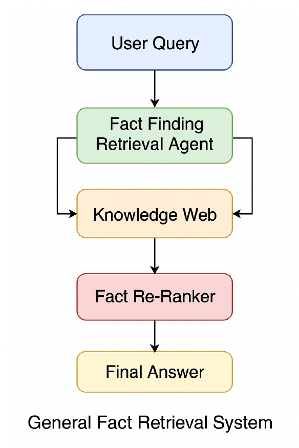

# Improving the Fact-Centric Knowledge Web with GPT-Based Fact Re-Ranking

This project is an enhancement of the paper **"Fact-Centric Knowledge Web for Information Retrieval"** presented at the **IEEE/WIC International Conference on Web Intelligence and Intelligent Agent Technology (WI-IAT 2024)**.

By integrating a **GPT-based fact re-ranking module** into the original retrieval-augmented generation (RAG) system, this project improves multi-hop question answering accuracy by 20%, avoids hallucinations, and enables reasoning through adaptive prompting.


## 🔧 Key Features

- **Paper-Based Reproduction**: Full re-implementation of the Fact-Centric Knowledge Web (FCKW) system from WI-IAT 2024.
- **LLM Integration**: Custom GPT-3.5 fact re-ranker module tailored to question types (inference, numeric reasoning, etc).
- **Performance Boost**: Improved Approximate Match Accuracy from **65.7% to 85%** on MuSiQue dataset.
- **Semantic Graph Search**: Utilized Pinecone vector search + Neo4j knowledge graph to retrieve semantically relevant facts.
- **Hallucination Mitigation**: The system gracefully rejects incorrect answers when supporting facts are missing.


## 🏗️ Architecture Overview



The system integrates Neo4j knowledge graphs with Pinecone vector search and GPT-based fact re-ranking to improve multi-hop question answering accuracy.


## 🛠️ Tech Stack

- `Python`
- `OpenAI GPT-3.5 API`
- `Neo4j` (for graph storage)
- `Pinecone` (vector database for keyword embedding)
- `MuSiQue` (multi-hop QA benchmark dataset)
- `Prompt Engineering` (query-type based prompt construction)

## 📈 Results

| Metric                  | Baseline (FCKW) | With GPT Re-Ranker |
|------------------------|------------------|---------------------|
| Approximate Match Accuracy | 65.7%            | **85.0%**            |

Examples show improved answer accuracy and avoidance of hallucination on complex multi-hop reasoning tasks.


---

## 🔍 Before & After: Real Example Cases

These examples demonstrate how the GPT-based re-ranking module improved the factual precision and reasoning ability of the system — even without any changes to the knowledge graph itself.

---

**Example 1: Numerical Reasoning**  
**Question:** How old was Yale Law School when it celebrated its centennial?  
- **Baseline Answer:** *Yale Law School celebrated its centennial in 1943.*  
- **Improved Answer:** *Yale Law School celebrated its centennial in 1943, making it 100 years old at the time of the celebration.* ✅  
- **Why it matters:** The baseline retrieved the correct year but failed to do the math; the re-ranker explicitly supports reasoning-based prompts.

---

**Example 2: Entity Disambiguation / Hallucination Prevention**  
**Question:** Which Ivy League school educated the future Zappos investor Tony Hsieh?  
- **Baseline Answer:** *Yale University educated the future Zappos investor Tony Hsieh.* ❌ (hallucinated)  
- **Improved Answer:** *The facts provided do not contain information about which Ivy League school educated Tony Hsieh.* ✅  
- **Why it matters:** The improved system avoids hallucinating unsupported claims by prompting the LLM to acknowledge missing evidence.

---

**Example 3: Date Calculation**  
**Question:** How old was Madonna when she moved to New York in 1977?  
- **Baseline Answer:** *No specific information about Madonna’s age in 1977 was found.*  
- **Improved Answer:** *Madonna was born in 1958, so she would have been 19 years old when she moved to New York City in 1977.* ✅  
- **Why it matters:** Shows that reasoning over partial facts (birth year + event year) can be enabled with question-type-aware prompting.


## 📁 Project Structure

```
rag-llm-fact-reranker/
├── src/rag_fact_reranker/     # Core source code
│   ├── knowledge_base.py      # Neo4j + Pinecone integration
│   ├── llm.py                 # OpenAI GPT integration
│   └── query_processor.py     # Query processing and re-ranking
├── scripts/                   # Utility scripts
│   ├── run_system.py         # Main system runner
│   └── count_facts.py        # Fact counting utility
├── tests/                     # Evaluation and testing
│   ├── evaluate_system.py    # System evaluation
│   └── dataset_questions_n20.json
├── docs/                      # Documentation and papers
│   ├── CS274_Report_MurunEnkhtaivan.pdf
│   └── fact_centric_paper.pdf
├── config/                    # Configuration files
│   └── config.yaml.example   # Configuration template
├── requirements.txt          # Python dependencies
└── .env.example             # Environment template
```

## 🚀 Getting Started

1. Clone this repo:
```bash
git clone https://github.com/yourusername/rag-llm-fact-reranker.git
```

2. Install dependencies:
```bash
pip install -r requirements.txt
```

3. Configure your environment:
```bash
# Copy configuration template
cp config/config.yaml.example config/config.yaml

# Copy environment template
cp .env.example .env

# Edit config/config.yaml with your API keys:
# - OpenAI API Key
# - Pinecone API Key + Environment
# - Neo4j DB URI, Username, Password
```

4. Build the knowledge base (first time):
```bash
python scripts/run_system.py --build-knowledge --n 100
```

5. Query the system:
```bash
python scripts/run_system.py
```

## 📚 Reference

Based on the paper:  
**"Fact-Centric Knowledge Web for Information Retrieval"**  
A. Sinha & Y. Shiramatsu, IEEE/WIC WI-IAT 2024  
[Link to Paper](https://ieeexplore.ieee.org/abstract/document/10973412)

This repo was created as a research-driven ML project by **Murun Enkhtaivan**, M.S. in Data Science, graduating December 2025.
